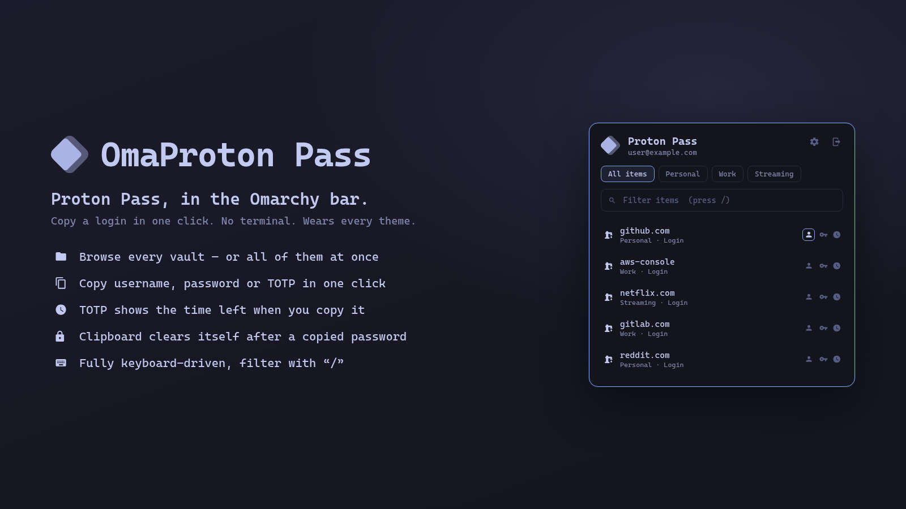

# OmaProton Pass

Proton Pass in the Omarchy bar. Browse your vaults and copy a login's
username, password, or TOTP code in a single click, without leaving the
bar. Wears every Omarchy theme, because it's built from the same Quattro
components as the Wi-Fi and Bluetooth panels.

## What you need

- Omarchy Quattro
- A [Proton](https://proton.me) account. A free account is enough to browse
  vaults and copy logins; the built-in TOTP authenticator and extra vaults
  may depend on your Proton plan.
- The official **Proton Pass CLI** (`pass-cli`) on your `PATH`:

  ```bash
  curl -fsSL https://proton.me/download/pass-cli/install.sh | bash
  ```

  The panel links to the download page if it isn't found.

## Install

```bash
omarchy plugin add https://github.com/doctahw/omaproton-pass --enable
```

Then click the Proton Pass mark in your bar and sign in.

## How to use it

- **Sign in** — the panel opens a floating terminal for `pass-cli login`
  (password + 2FA). It flips to the vault view on its own when you're done.
  If your session is lock-protected it offers **Unlock** instead.
- **Vaults** — the badge carousel above the filter. `All items` (first)
  merges every vault. Click a badge, or walk them with `←`/`→`.
- **Filter** — press `/` and type to narrow the list by title.
- **Copy** — each login row has three icons on the right: username, password,
  TOTP. Click one to copy that field. The item's detail is fetched from
  `pass-cli` on the first copy and cached after that.
- **Settings** (gear, top-right) — how long a copied password stays on the
  clipboard (`Off` / `15s` / `30s` / `60s`), and whether to show a
  "Password copied" desktop notification.
- **Sign out** (top-right) — asks for a second click within five seconds,
  then runs `pass-cli logout`.

Everything is keyboard-driven: `↑`/`↓` between sections, `←`/`→` within one,
`Enter` to act, `Esc` to close.

## Update / Remove

```bash
omarchy plugin update io.github.doctahw.omaproton-pass
omarchy plugin remove io.github.doctahw.omaproton-pass
```

Removing the plugin leaves your `pass-cli` session alone. Its own small
state file lives at `~/.local/state/omarchy-protonpass/state.json` (just the
two settings above); delete it if you like.

## Privacy

- **No credentials are stored by this plugin.** Your password and 2FA go
  straight into the `pass-cli` prompt in a terminal; the plugin never sees
  them.
- Every subprocess is an argument list, never a shell string. The one
  exception is the clipboard copy (`printf … | wl-copy`), where the value is
  single-quoted with Omarchy's shared `Util.shellQuote` first.
- Item secrets are read only when you actually copy a field — `pass-cli item
  view` is not called just by opening the panel or listing a vault.
- Copied passwords and TOTP codes are marked `--sensitive` for the
  compositor, and the clipboard is wiped after the configured delay **only
  if it still holds the value this plugin put there**.
- The plugin makes no network requests of its own; all traffic is whatever
  `pass-cli` does.

## Credits & trademark

The Proton Pass mark is redrawn natively from Proton's own icon so it takes
your theme colour. Proton and Proton Pass are trademarks of Proton AG. This
is an unofficial community plugin and is not affiliated with or endorsed by
Proton AG.

The project is also heavily inspired by [Omaproton VPN](https://github.com/grichard99/omaproton-vpn).

## License

[MIT](LICENSE)
